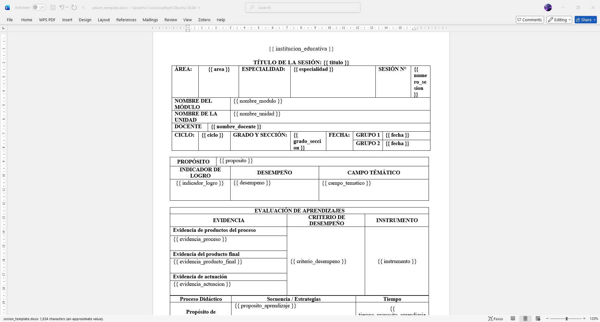
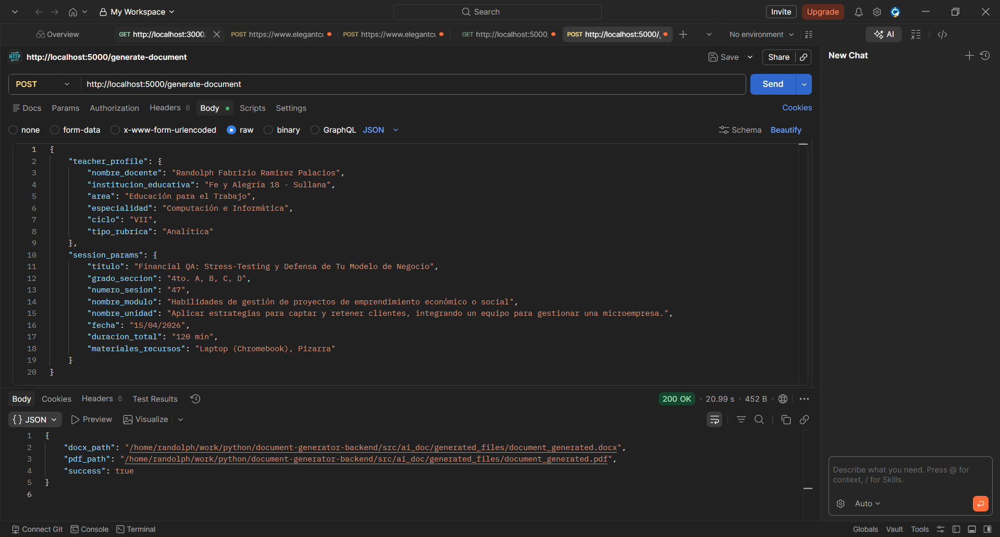
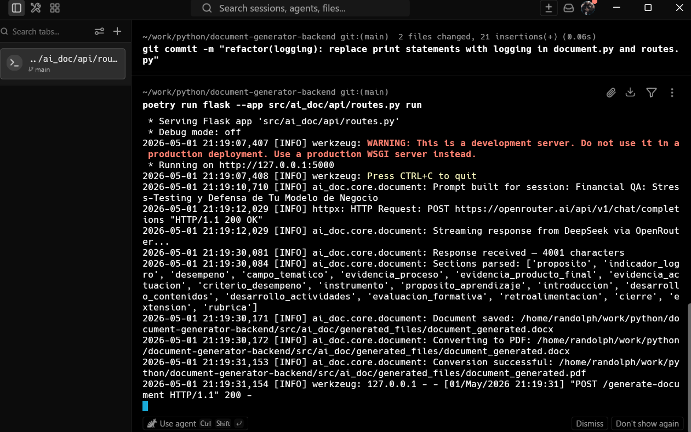
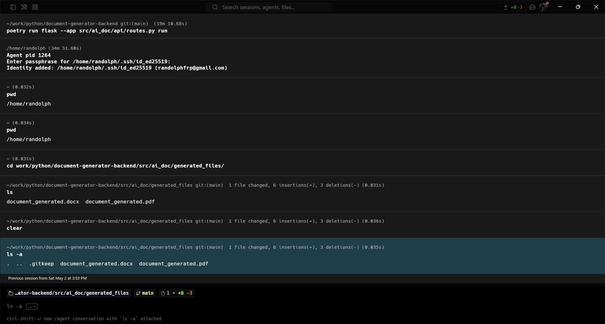
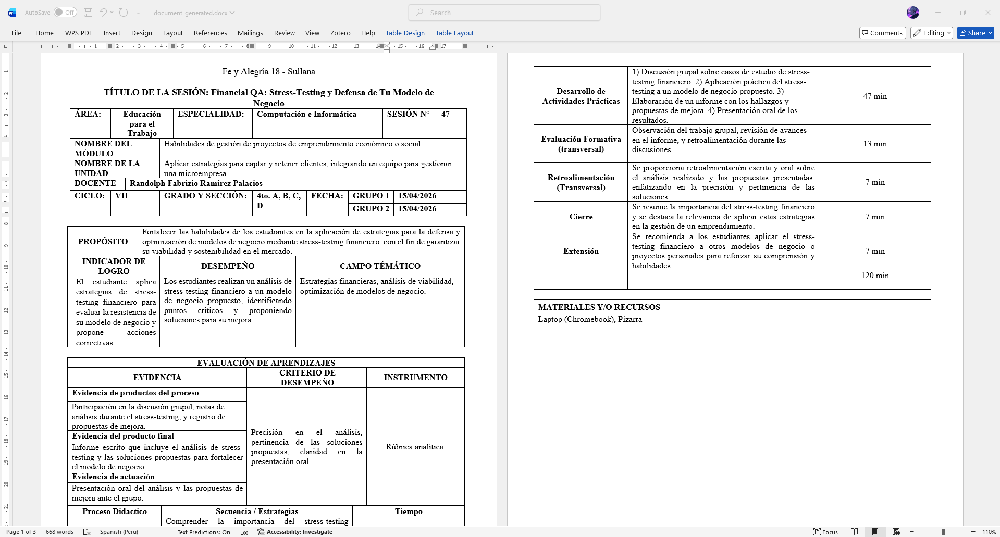
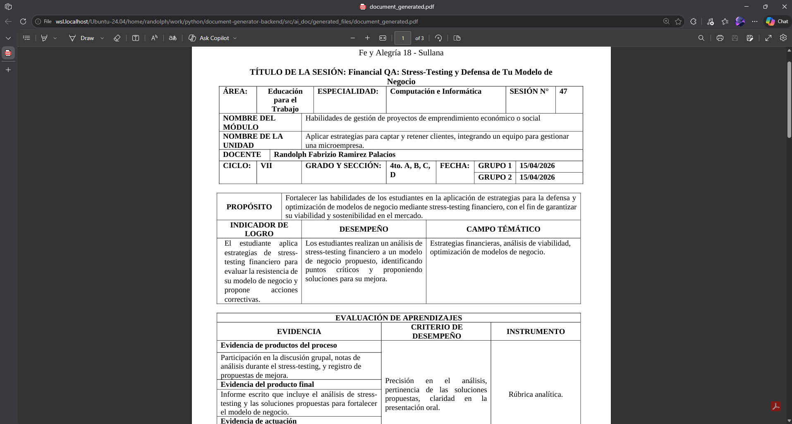

# Document Generator Backend

Flask backend that generates complete learning sessions for Peruvian teachers using AI. The teacher enters their profile data and the session topic, and the system automatically produces a ready-to-use Word document along with its PDF version.

> **Status:** Backend functional, in evolutionary enhancement and feature expansion phase.  in evolutionary maintenance and refactoring phase.

---

## Screenshots

<!-- A Word template containing Jinja2 tags. -->


<!-- Request and response in Postman / Thunder Client -->


<!-- Request info in the terminal.   -->


<!-- Generated Files from the Request   -->


<!-- Word document generated by the system -->


<!-- PDF generated by LibreOffice -->


---

## Table of contents

- [Screenshots](#screenshots)
- [Demo flow](#demo-flow)
- [Tech stack](#tech-stack)
- [Project structure](#project-structure)
- [Local setup](#local-setup)
- [API usage](#api-usage)
- [AI-generated sections](#ai-generated-sections)
- [Deploy](#deploy)
- [Git workflow](#git-workflow)
- [Author](#author)

---

## Demo flow

```
Teacher fills out the form (React frontend)
        ↓
POST /generate-document
        ↓
routes.py → validates teacher_profile and session_params
        ↓
core/prompt.py → builds the prompt from teacher and session data
        ↓
DeepSeek API (via OpenRouter) → generates content in streaming mode
        ↓
core/parser.py → extracts each section from the response using regex
        ↓
core/document.py → DocxTemplate fills the Word template + LibreOffice converts to PDF
        ↓
Returns doc_path and pdf_path to the frontend
```

---

## Tech stack

| Technology | Purpose |
|---|---|
| Python 3.x | Main language |
| Flask | Web framework |
| Flask-CORS | CORS handling for the React frontend |
| Poetry | Dependency management |
| DocxTemplate | Word template rendering with variables |
| OpenAI SDK | HTTP client for OpenRouter / DeepSeek |
| python-dotenv | Environment variable loading from `.env` |
| LibreOffice (`soffice`) | Headless `.docx` to PDF conversion |

---

## Project structure

```
document-generator-backend/
├── src/
│   └── ai_doc/
│       ├── __init__.py
│       ├── config.py               # Environment variable loading
│       ├── api/
│       │   ├── __init__.py
│       │   └── routes.py           # Flask endpoints
│       ├── core/
│       │   ├── __init__.py
│       │   ├── prompt.py           # AI prompt construction
│       │   ├── parser.py           # Response section extraction
│       │   └── document.py         # .docx generation and PDF conversion
│       ├── templates/
│       │   └── sesion_template.docx  # Word template with DocxTemplate variables
│       └── generated_files/
│           └── .gitkeep            # Gitignored folder for generated files
├── tests/
│   └── __init__.py
├── .env.example
├── .gitignore
├── .python-version
├── poetry.lock
├── pyproject.toml
└── README.md
```

---

## Local setup

### Prerequisites

- Python 3.x
- [Poetry](https://python-poetry.org/docs/#installation)
- [LibreOffice](https://www.libreoffice.org/download/download/) (for PDF conversion)
- An API key from [OpenRouter](https://openrouter.ai)

On Ubuntu / Debian you can install LibreOffice directly from the terminal:

```bash
sudo apt update
sudo apt install libreoffice-writer -y
```

### Steps

**1. Clone the repository**

```bash
git clone https://github.com/tu-usuario/document-generator-backend.git
cd document-generator-backend
```

**2. Install dependencies**

```bash
poetry install
```

> To install dependencies without the project package:
> ```bash
> poetry install --no-root
> ```

**2.1. (Optional) Generate the virtual environment inside the project**

By default Poetry stores environments in `~/.cache/pypoetry/virtualenvs/`. If you prefer to keep it inside the project folder (useful for VSCode and other editors):

```bash
poetry config virtualenvs.in-project true
poetry env remove <cached-env-name>  # remove the cached env if it already exists
poetry install
```

To activate the environment manually:

```bash
source .venv/bin/activate
# or
poetry env activate <env-name>
```

**3. Configure environment variables**

Create a `.env` file at the project root based on the included example:

```bash
cp .env.example .env
```

Edit `.env` and add your API key:

```env
API_KEY=your_openrouter_api_key
```

**4. Run the server**

```bash
poetry run flask --app src/ai_doc/api/routes.py run
```

The server will be available at `http://localhost:5000`.

---

## API usage

### `GET /`

Health check. Confirms the server is active.

**Response:**
```
Flask API is running!
```

---

### `POST /generate-document`

Generates a complete learning session in Word and PDF format.

**Request body:**

```json
{
  "teacher_profile": {
    "nombre_docente": "Randolph Fabrizio Ramirez Palacios",
    "institucion_educativa": "Institución Educativa Randix - Sullana",
    "area": "Educación para el Trabajo",
    "especialidad": "Computación e Informática",
    "ciclo": "VII",
    "tipo_rubrica": "Analítica"
  },
  "session_params": {
    "titulo": "Taller de Consolidación: Revisión y Avance del Proyecto",
    "grado_seccion": "4to. A, B, C, D",
    "numero_sesion": "40",
    "nombre_modulo": "Habilidades de gestión de proyectos de emprendimiento económico o social",
    "nombre_unidad": "Aplicar estrategias para captar y retener clientes",
    "fecha": "29/10/2025",
    "duracion_total": "90 min",
    "materiales_recursos": "Laptop (Chromebook), Pizarra"
  }
}
```

> The `fecha` field is optional. If omitted, today's date is used in `DD Mon, YYYY` format.

**Responses:**

| Code | Description |
|---|---|
| `200 OK` | Successful generation. Returns `docx_path` and `pdf_path`. |
| `400 Bad Request` | Missing or invalid required field. |
| `404 Not Found` | Template or file not found. |
| `500 Internal Server Error` | Generation or LibreOffice error. |

**Successful response (200):**
```json
{
  "success": true,
  "docx_path": "/path/to/document_generated.docx",
  "pdf_path": "/path/to/document_generated.pdf"
}
```

**Error response (400):**
```json
{
  "success": false,
  "error": "The 'titulo' field in session_params is required."
}
```

---

## AI-generated sections

The AI automatically generates the content for the following sections, which are injected into the Word template:

| Key | Description |
|---|---|
| `proposito` | General session purpose |
| `indicador_logro` | Expected achievement indicator |
| `desempeno` | Student performance descriptor |
| `campo_tematico` | Session thematic field |
| `evidencia_proceso` | Process product evidence |
| `evidencia_producto_final` | Final product evidence |
| `evidencia_actuacion` | Performance evidence |
| `criterio_desempeno` | Performance criterion for evaluation |
| `instrumento` | Evaluation instrument |
| `proposito_aprendizaje` | Learning purpose (didactic process) |
| `introduccion` | Introduction / opening activity |
| `desarrollo_contenidos` | Thematic content development |
| `desarrollo_actividades` | Practical activity development |
| `evaluacion_formativa` | Transversal formative evaluation |
| `retroalimentacion` | Transversal feedback |
| `cierre` | Session closure |
| `extension` | Extension activity |
| `rubrica` | Evaluation rubric (analytic or holistic) in JSON format |

Time distribution per didactic moment is calculated automatically from `duracion_total` and injected as additional variables into the template.

---

## Deploy

The backend is designed to be deployed on **Railway** and the React frontend on **Vercel**.

### Railway (Flask backend)

1. Connect the repository on [railway.app](https://railway.app).
2. Set the `API_KEY` environment variable in the Railway dashboard.
3. Railway automatically detects the Python project with Poetry.

> **Note on LibreOffice:** PDF conversion requires `soffice`. On Railway a buildpack that includes LibreOffice may be needed, or an alternative like [Gotenberg](https://gotenberg.dev) should be evaluated.

---

## Git workflow

This project follows **Git Flow** with `--no-ff` on all merges to maintain a narrative and traceable history.

### Branch naming convention

```
feature/description-in-english   # New functionality
refactor/description-in-english  # Code restructure or improvement
fix/description-in-english       # Bug fix
docs/description-in-english      # Documentation
chore/description-in-english     # Configuration or maintenance
```

### Commit convention (Conventional Commits)

```
feat: description      # New functionality
refactor: description  # Code restructure
fix: description       # Bug fix
docs: description      # Documentation
chore: description     # Configuration or maintenance
```

### Merge to main

```bash
git checkout main
git merge --no-ff branch-name -m "type: merge description"
git push origin main
```

---

## Author

**Randolph Fabrizio Ramirez Palacios**
[GitHub](https://github.com/XRandolphX)


